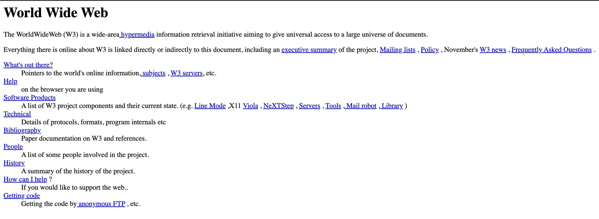

# Onde tudo começou

<a href="https://info.cern.ch/" target="_blank">CERN Website</a>

<!--
1991 | CERN (Organização Europeia para Pesquisa Nuclear) | britânico Tim Berners‑Lee.

O site inicial continha explicações sobre o Web, instruções para criar páginas web e demonstrações de hipertexto — ou seja, ligações (“links”) entre textos.

Apesar de simples, o website simboliza a transição de redes de pesquisa restritas para uma plataforma global de comunicação, educação e negócios.
-->